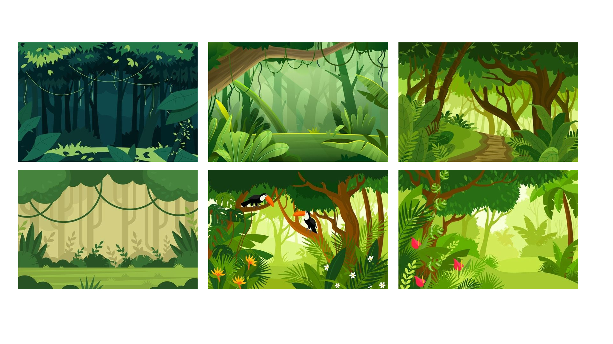
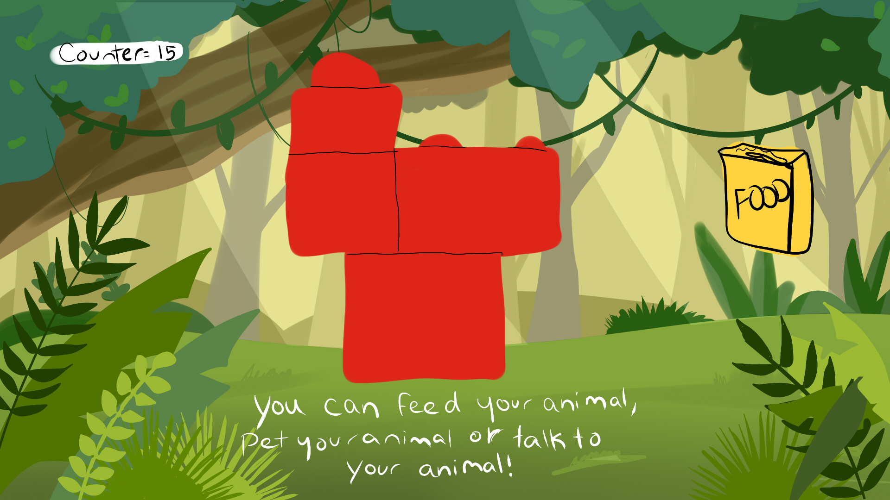
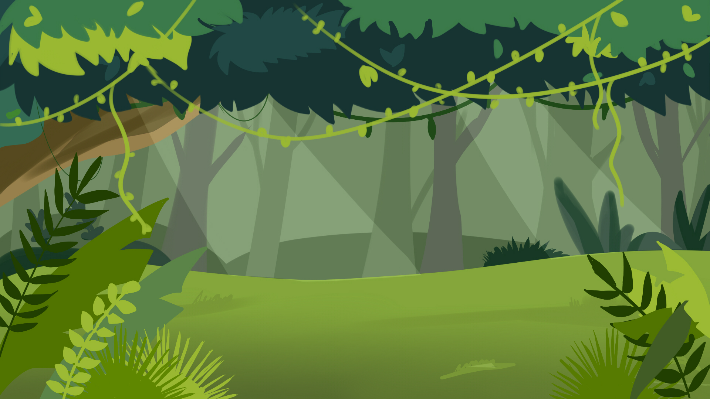

# Playful Interaction project 
##### Mariam Aoune & Maloney Khim, April 13th. 

Game screenshot here! (To be added)

As kids, we loved the virtual pet games of the 2000s like Webkinz or Neopets. We also felt nostalgic about legos and how children can have fun creating characters and objects with it. Thus, we decided to combine both elements to create a game. In our project, the player builds an animal with the legos blocks and then takes a picture. Their animal turns into a virtual pet and the user can then interact with it. The program detects the legos and then a progress bar based on affection appears on the side of the screen. The user can only click inside of the red square, they cannot click outside of it. There are gifs of plants decorating the canvas to make it look more alive. The goal of the game is to fill the progress bar 8 times to receive 8 gifts from the pet. When 8 gifts are received, the user can download a screenshot of their virtual pet.

Here are the steps to the game:

1) After seeing the loading page, the player builds an animal with the red lego blocks.
2) They put them in front of the cardboard background and take a picture of it with a webcam within the delimited zone.
3) They listen and/or read the instructions to the game.
4) They fill the progress bar 8 times by interacting with their pet.
5) Those interactions include:  dressing up their pet (by dragging and dropping an item on them), feeding their pet(by clicking on the button that says Feed the pet and then clicking on the pet) and talking with the pet.
6) When the user collected the eight gifts, they receive a screenshot of their pet. Hooray, the user has finished the game!!! :D

## Installation
First, download the project folder on GitHub. Then download the p5.speech library and put it in the libraries folder if it's not already in the index.html file. You will also need a decent quality webcam camera, some red lego blocks (important to only use that color) and a cardboard jungle background.

## Run
To run the code, open the project folder on Visual Studio Code and make it go live. Build an animal with the red lego blocks. Connect a webcam to the computer and ideally, go sit next to the windows and take the picture of the lego block pet near a white wall. The animal has to be inside the square red frame. Then, the user can interact with the animal on the computer screen in multiple ways such as dressing it, feeding it or talking with it. The four things the user can tell the pet are: "How are you?", "I love you" and "You look cool" The user cannnot interact with their pet if they click outside the red square.

## Future iterations

We would love to find a way to make our code create a digital drawing based on the picture taken. It would detect the color of the block (red), and recreate the lego blocks animal with shapes in p5js. The animal will then be placed in the middle of the background.

## Sketches, ideas

Moodboard for the jungle background. 

Initial sketch

Background (all the elements together, not-animated)

Dressing up items & Food

Loading page animation

## Credits, resources, etc 

* Code reference : ChatGPT, The Coding Train & P5.js Reference
* Instruction voice: Maloney's sister
* Game soundtrack sources : BBC Sound Effects & Pixabay Geoff Harvey
* Wood background : Adobe Stock
* Font used: Delicious Handrawn (Google Fonts)

## Anything else?

Instruction text :

You find yourself lost in the middle of a dense jungle with no idea how to get out. Suddenly, you come across a friendly animal that can help you find your way back to civilization! But in order to earn their trust, you'll need to raise their affection progress bar by playing with them and taking care of them.

To get started, give your animal friend a name. Then, you can dress them up, feed them, and talk to them to make them happy! Remember, if you ask them how they're doing or give them compliments, they'll be even happier and their progress bar will fill up faster.

Once you've filled up their progress bar to 100%, you'll receive a gift from your animal friend! Collect 8 gifts and you'll be able to save a picture of your new jungle buddy.

So, are you ready to make a new friend and find your way out of the jungle? Let's get started!
